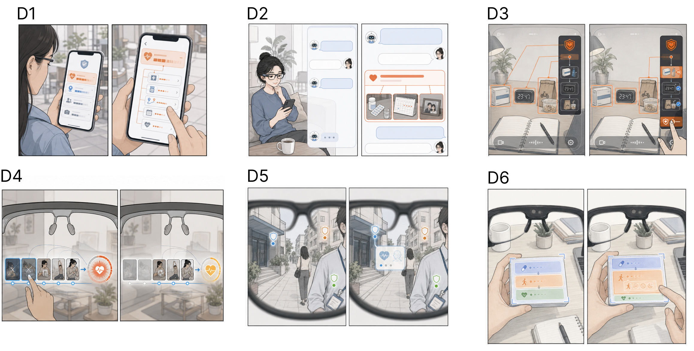
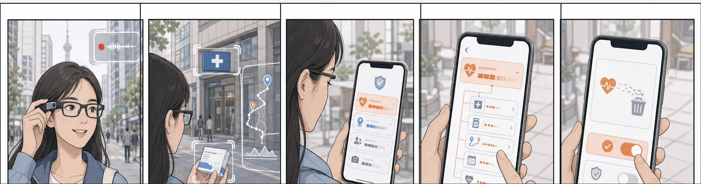
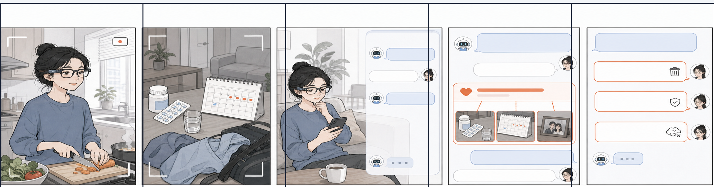
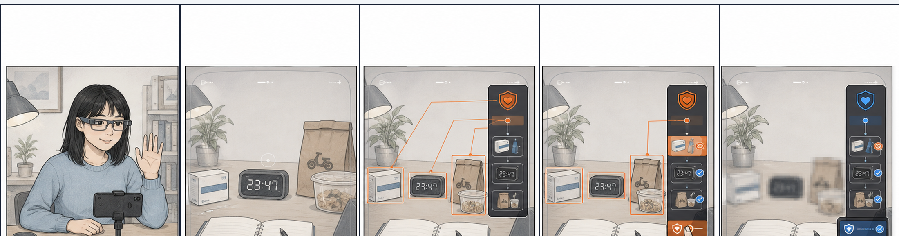
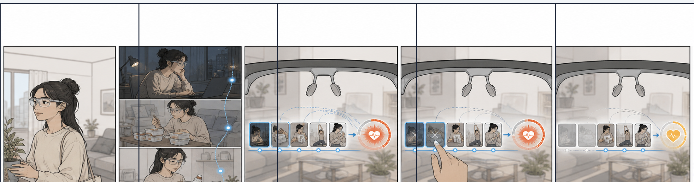
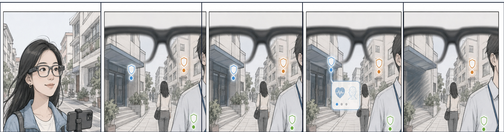

# Six Design Concepts and Storyboards

The D1–D6 names follow the manuscript. The [standalone demonstration](../prototype/README.md) and [evaluation-flow reference](../study-reference/README.md) provide interactive entry points. The images and five-step English captions are taken from the local prototype materials. Each storyboard describes an envisioned use situation; simulated masking or forgetting illustrates an interaction concept.

**Material version:** the storyboards below come from the local August 17 prototype snapshot. Their equivalence to the later collection build remains to be confirmed. The overview is the previously saved Figma frame 68:2.

## D1. Central Risk List

Data identifier: `panel`.

A separate panel consolidates inferred attributes. The user opens a category, reviews its evidence, and manages the inference and associated clues. The accompanying storyboard places review after the current task.

No alert interrupts the current task; later, a companion-phone list consolidates health, location, and other inferences formed across contexts.

1. **Person.** Alice wears smart glasses in daily life and uses AI to record routes, recognize surroundings, and manage her schedule.
2. **Event and setting.** During the day, the glasses see a clinic sign, appointment information, and a frequently traveled route—none of which Alice intentionally provided as health data.
3. **Design appears.** The system does not interrupt her immediately. Later, a companion phone lists possible health, location, and other privacy inferences in one panel.
4. **User interaction.** Alice opens Health status and reviews supporting evidence such as the clinic location and appointment text, along with possible consequences.
5. **Outcome.** She deletes the health inference and prevents the system from continuing to use the clinic location and appointment text.

## D2. Conversational Control

Data identifier: `dialog`.

A conversational interface explains the inference and supports follow-up questions about evidence and use. The user can request that an inference be forgotten or that relevant clues be excluded from future memory.

After the task, a conversation explains the health inference and lets the user ask about evidence, use, and longer-term effects before deciding.

1. **Person.** Alice wears smart glasses while organizing a work desk and wants AI only to identify and categorize objects.
2. **Event and setting.** The glasses also see medicine, a follow-up reminder, and late-night work—clues beyond the current organization task.
3. **Design appears.** After the task, AI starts a conversation on a companion device and explains that multiple clues may form a health-status judgment.
4. **User interaction.** Alice asks why the judgment was made and how it may be used; the system explains step by step with evidence such as medicine and a calendar.
5. **Outcome.** After understanding the impact, she asks the system to forget the inference and keep the related clues out of long-term memory.

## D3. Marked Clues with Side Explanation

Data identifier: `boxedPanel`.

Markers locate evidence in the original scene while a side panel explains the relationship between objects and an inferred attribute. The user selects evidence to restrict or mask, and the panel displays the resulting change.

Clues are marked directly in the original scene, while a side panel links objects, evidence, inference, and action results.

1. **Person.** Alice wears smart glasses while organizing a desk, with AI continuously identifying objects in view.
2. **Event and setting.** Medicine, time information, and delivery packaging appear together and may reveal health or daily-routine information.
3. **Design appears.** The glasses mark relevant objects in the original scene, while a layered side panel explains how they may support a health-status inference.
4. **User interaction.** Alice uses the side panel to select the specific objects that should be restricted or masked.
5. **Outcome.** The selected areas are masked, and the panel updates to show that the inference risk has decreased.

## D4. Step-by-Step Timeline

Data identifier: `timeline`.

A timeline connects clues across moments and identifies when they support an inference. The user revisits relevant moments and removes or restricts selected clues.

A timeline connects ordinary clues seen at different times and shows when a health inference forms and how it changes after action.

1. **Person.** Alice wears smart glasses over time while handling work and everyday activities.
2. **Events over time.** At different times, the glasses see medicine, a follow-up reminder, deliveries, and late-night work; each clue alone appears ordinary.
3. **Design appears.** The glasses show a timeline that connects clues across moments and marks when the health inference forms.
4. **User interaction.** Alice moves along the timeline to revisit key moments and selects clues to remove or restrict.
5. **Outcome.** The timeline updates after her actions, and the associated health-inference risk decreases.

## D5. Contextual Lightweight Hint

Data identifier: `hint`.

A lightweight cue appears close to a relevant location or object. Further explanation and actions become available when the user attends to the cue, supporting a brief intervention before returning to the task.

While the user is moving, only a lightweight marker appears near a relevant location; details and actions expand only when requested.

1. **Person.** Alice walks through a neighborhood wearing smart glasses and uses navigation and scene-recognition features.
2. **Event and setting.** She passes a clinic, a residential entrance, and other places that may reveal identity or health information.
3. **Design appears.** A lightweight dot and shield appear beside relevant locations to signal a possible link to health or identity information.
4. **User interaction.** Only after Alice looks at a hint does it expand into a short risk explanation and action options.
5. **Outcome.** She quickly hides the location clue; the hint collapses into a protected state, and she continues her original task.

## D6. In-place Risk Action

Data identifier: `contained`.

Explanation and actions appear directly within the relevant risk region. The user inspects the evidence and acts within the same region, reducing the need to switch to a separate panel.

Risk explanation and actions appear directly within the relevant object, so protection can be completed without switching to a side panel.

1. **Person.** Alice works at a desk wearing smart glasses while AI helps identify objects in view.
2. **Event and setting.** When she looks at medicine and follow-up materials, the system detects that these objects may contain sensitive health clues.
3. **Design appears.** A risk box attaches directly to the relevant object and reveals the object, evidence, and possible health inference within the box.
4. **User interaction.** Without switching to a side panel, Alice chooses an action directly inside the same risk box.
5. **Outcome.** The sensitive content is masked, and the risk box collapses so it no longer obstructs her view.
